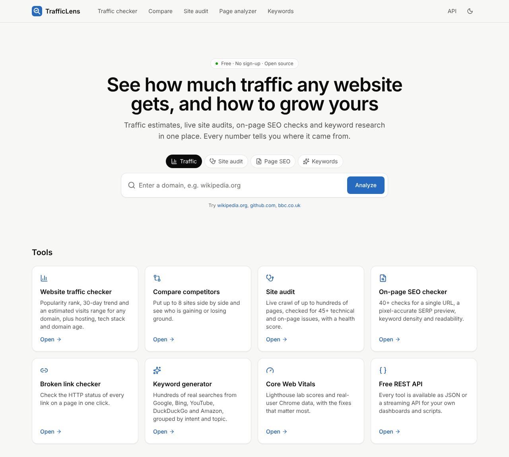
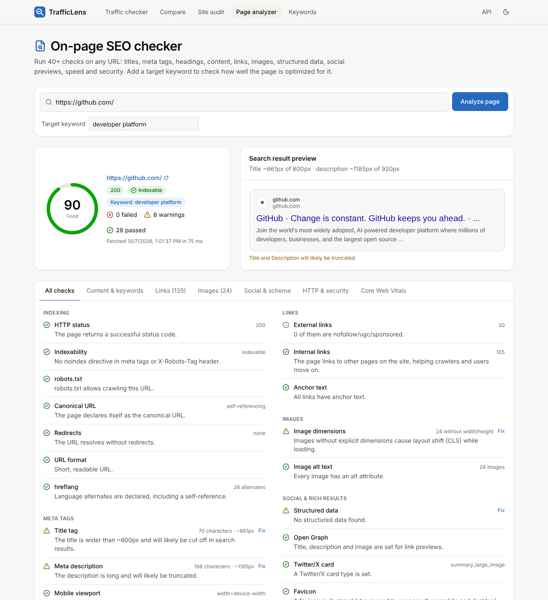
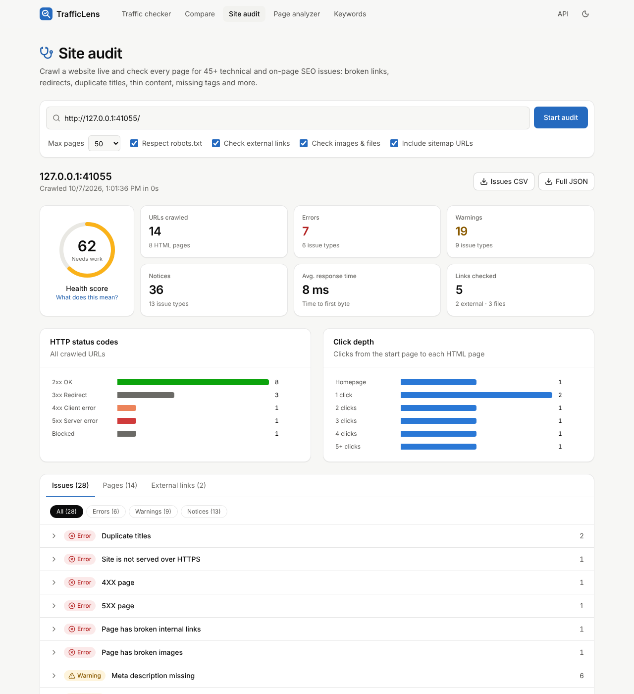

# TrafficLens

**A free, open-source website traffic checker and SEO toolkit.** Check any site's traffic and popularity, audit its SEO with a live crawl, analyze individual pages and generate keyword ideas. No account, no paywall, and every metric explains where it came from.

It covers the everyday jobs people use paid suites such as Ahrefs for, and it is upfront about the few things only a paid, web-scale index can do.



## Tools

| Tool | What it does |
| --- | --- |
| **Website traffic checker** (`/traffic`) | Popularity rank and 30-day trend, an estimated monthly-visits *range*, popularity tier, homepage SEO score and search preview, technology stack (130+ fingerprints, each with its evidence), robots.txt and sitemap size, server/TLS/security headers, domain registration (RDAP), DNS and email setup (SPF, DMARC, CAA, providers), archive history, and on-demand Core Web Vitals. Sections stream in as soon as each source answers. |
| **Compare** (`/compare`) | Up to 8 competitors side by side: rank history chart, 30-day movement, visit estimates, CSV export. |
| **Site audit** (`/audit`) | Live breadth-first crawl (sitemap-aware, robots.txt and crawl-delay respecting) checking **48 issue types**: 4xx/5xx pages, broken internal/external links and images, redirect chains and loops, duplicate/missing titles and descriptions, thin and duplicate content, orphan pages, noindex/canonical conflicts, mixed content, click depth, HTTP→HTTPS and www canonicalization, and more. Health score, status and depth charts, sortable page table, CSV/JSON export. |
| **On-page SEO checker** (`/analyzer`) | 43 weighted checks with how-to-fix guidance, a **pixel-accurate** Google result preview, heading outline, 1–3-word phrase density, Flesch readability, target-keyword placement, structured data validation, Open Graph preview, redirect chain, TLS and security headers. |
| **Broken link checker** (in the analyzer) | One click checks the HTTP status of every link on the page. |
| **Keyword generator** (`/keywords`) | Hundreds of real searches from Google, Bing, YouTube, DuckDuckGo and Amazon autocomplete, across 17 countries. Grouped into questions, comparisons, prepositions and long-tail, with search intent, topic clusters, copy and CSV export. |
| **REST API** (`/api-docs`) | Everything above as JSON or streaming NDJSON. |

<p>
  
  
</p>

*Left: the page analyzer on github.com (live data). Right: a site audit of the deliberately broken test site in `tests/helpers/fixture-site.ts`.*

## How it compares to paid SEO suites

| | TrafficLens | Typical paid suites (Ahrefs, Semrush…) |
| --- | --- | --- |
| Price / account | Free, no account | Subscription, account required |
| Site audit | Live crawl, no setup | Project setup and crawl quotas |
| On-page checks, link checker, tech stack | ✅ | ✅ |
| Keyword ideas | Live autocomplete from 5 engines | Proprietary keyword database |
| Search volume & keyword difficulty | Relative "suggest score" only | ✅ |
| Traffic estimates | Rank-based range with a published model | Model-based single number |
| Backlink index, rank tracking | ❌ (needs a web-scale crawl or paid SERP data) | ✅ |
| Method linked from every metric | ✅ ([/methodology](app/methodology/page.tsx)) | Partially |
| Self-hosting, open source, full API | ✅ | ❌ / API on higher tiers |

## Where the data comes from

All free and public. Optional keys unlock two extras.

| Data | Source |
| --- | --- |
| Popularity rank & history | [Tranco](https://tranco-list.eu) research ranking (top 1M, 30-day average of several lists) |
| Monthly visits | Log-log interpolation of rank between published calibration anchors, shown as a range (`lib/traffic-model.ts`) |
| Page content, headers, TLS, tech stack, robots.txt, sitemaps | Fetched live from the site |
| Registration | [RDAP](https://about.rdap.org) via IANA's bootstrap registry (rdap.org fallback) |
| DNS & email | Live DNS queries |
| History | Internet Archive CDX API |
| Keyword ideas | Search-engine autocomplete endpoints |
| Core Web Vitals | Google PageSpeed Insights (Lighthouse + Chrome UX Report). Set `PAGESPEED_API_KEY` for reliable quota. |
| Authority score (optional) | [Open PageRank](https://www.domcop.com/openpagerank/), when `OPENPAGERANK_API_KEY` is set |

Nothing is invented: when a source fails, the UI says so (for example "Lookup failed" vs. "Missing") instead of showing a guess.

## Quick start

Requires Node.js 20.9+.

```bash
npm install
npm run dev          # http://localhost:3000
```

Production:

```bash
npm run build
npm start
```

### Docker

The app builds as a Next.js standalone server:

```bash
docker build -t trafficlens .
docker run -p 3000:3000 -e PAGESPEED_API_KEY=... trafficlens
```

### Configuration

All optional. See [`.env.example`](.env.example).

| Variable | Purpose |
| --- | --- |
| `PAGESPEED_API_KEY` | Google API key with PageSpeed Insights enabled, for Core Web Vitals |
| `OPENPAGERANK_API_KEY` | Adds an authority score (0–10) to the traffic report |
| `MAX_AUDIT_PAGES` | Hard cap on pages per audit (default 200, max 1000) |
| `API_RATE_LIMIT_PER_MINUTE` | Per-IP request budget for the API (default 60) |
| `SITE_URL` | Public base URL, used in `sitemap.xml` and `robots.txt` |
| `ALLOW_PRIVATE_HOSTS` | **Development only.** Lets the fetcher reach localhost/private IPs. Never enable on a public deployment. |

Deploying to a serverless platform works, but long audits need a function time limit of a few minutes (`maxDuration` is set to 300s on the audit route). A long-running Node server or container is the best fit.

## Safety and politeness

- **SSRF protection:** every user-supplied URL is validated (http/https only, ports 80/443/8080/8443, no credentials, no private/loopback/link-local/metadata addresses). The DNS check runs *at connect time* on every redirect hop, so DNS rebinding and redirects to internal hosts are refused too (`lib/net/guard.ts`).
- **Polite crawler:** identifies as `TrafficLensBot`, obeys robots.txt (RFC 9309 matching) and crawl-delay by default, caps concurrency at 5 and limits pages per audit.
- **Rate limits:** per-IP limits on every endpoint; one concurrent audit and 10 audits/hour per IP.
- **Privacy:** reports are generated on request and not stored. Recent searches live only in the visitor's browser.

## API

```bash
curl 'http://localhost:3000/api/v1/traffic?domains=github.com,gitlab.com'
curl 'http://localhost:3000/api/v1/analyze?url=https://example.com/&keyword=example'
curl -N 'http://localhost:3000/api/v1/overview?domain=example.com'     # NDJSON stream
curl -N 'http://localhost:3000/api/v1/audit?url=https://example.com&maxPages=50'
curl 'http://localhost:3000/api/v1/keywords?q=coffee+grinder&depth=deep'
```

Full reference: `/api-docs` in the running app.

## Project structure

```
app/                 Next.js App Router pages and /api/v1 route handlers
components/          UI (tool pages, report panels, SVG charts, tables)
lib/net/             SSRF-safe HTTP client (redirects, TTFB, compression, TLS)
lib/seo/             HTML extraction, scored checks, robots.txt, sitemaps, tech detection, text metrics
lib/audit/           Crawler, issue engine and health score
lib/keywords/        Autocomplete expansion, scoring, intent and clustering
lib/sources/         Tranco, RDAP, DNS, Wayback, PageSpeed, Open PageRank, autocomplete clients
lib/traffic-model.ts Rank → visits model
tests/               Vitest unit tests + integration tests against a local fixture website
```

## Development

```bash
npm test             # unit + integration tests (spins up a local test website)
npm run lint
npm run typecheck
```

The integration tests crawl `tests/helpers/fixture-site.ts`, a small site with deliberate problems (broken links, redirect chains and loops, duplicate titles, orphan and noindex pages, robots-blocked URLs), and assert that each one is detected.

## Limitations

- No backlink index, absolute search volumes, keyword difficulty or rank tracking. Each needs a proprietary web-scale crawl, clickstream data or paid SERP access.
- The crawler does not execute JavaScript, so content that only exists after client-side rendering is invisible to it (as it is to many search crawlers).
- Traffic figures are order-of-magnitude estimates derived from a popularity rank. Sites outside the top million are reported as likely under ~9K visits/month.

## License

[MIT](LICENSE)
